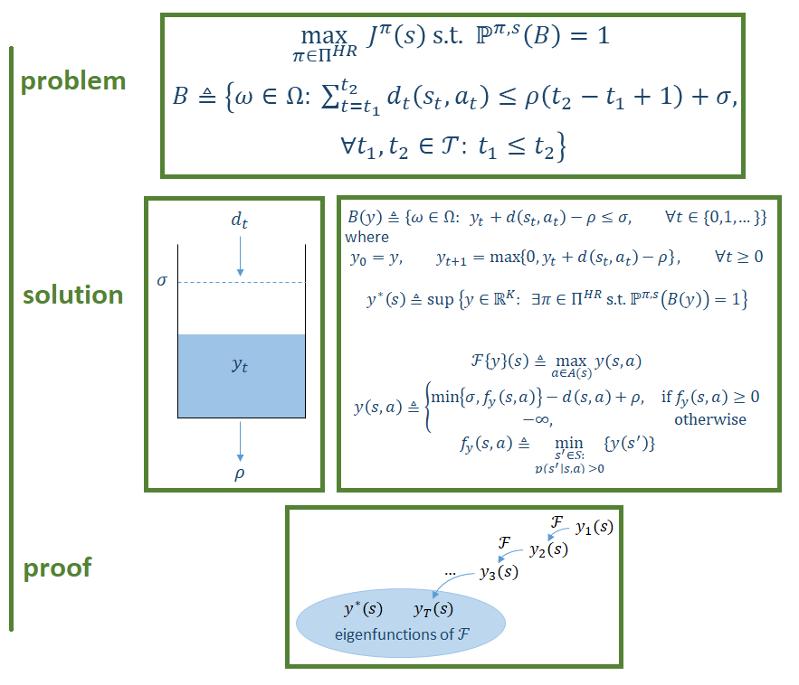

# Michal Golan

<h1 style="display: flex; justify-content: space-between; align-items: center;">
  
  
    
    
  
</h1>

<table>
<tr>
<td align="center">
 
<a href="https://github.com/migolan/nuFFTW"><b>nuFFTW</b></a> 
An auto-tuning, parallel library for computation of the non-uniform fast Fourier transform
</td>
<td align="center">
 
<a href="/projects/BCMDP/BCMDP.md"><b>BCMDP</b></a> 
My MSc Thesis on Burstiness-Constrained Markov Decision Processes
</td>
<td align="center">
 
<a href="/projects/DeepMind Reinforcement Learning Course/DeepMind Reinforcement Learning Course.md"><b>DeepMind Reinforcement Learning Course Mindmap</b></a>  Mindmap cheetsheets for DeepMind's   Reinforcement Learning Course with David Silver
</td>
</tr>

<tr>
<td align="center">
 
<a href="https://github.com/migolan/IHM-route-analysis"><b>Improved elevation gain computation on IHM</b></a> 
Improving computation of the cumulative elevation gain along planned routes on the IHM app
</td>
</tr>
</table>
